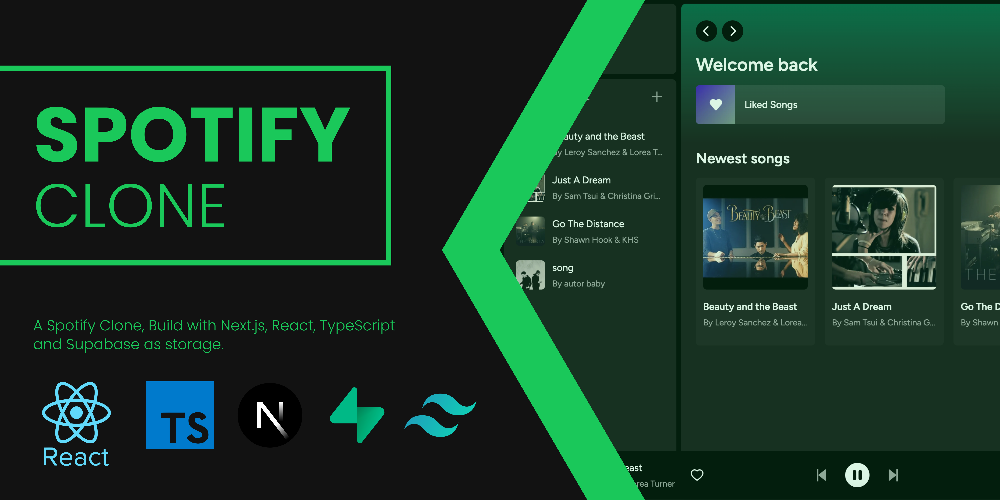

## Full Stack Spotify Clone: A Next.js, React, Typescript & Supabase Project

### Description:
In this project, I undertook the creation of a comprehensive music streaming application from the ground up, mirroring the beloved features and functionalities of Spotify. Leveraging Next.js 13.4 and React, I developed an immersive, responsive, and dynamic user interface that closely emulates Spotify's sleek design. By harnessing the flexibility of Tailwind CSS, I achieved a visually stunning result, paying meticulous attention to every detail of the UI.

To power the backend, I employed Supabase, an open-source alternative to Firebase, built on PostgreSQL. This choice facilitated the creation of a robust foundation for the application. I meticulously established the Supabase project, designed database schemas, and seamlessly implemented authentication processes to ensure a secure user registration and login system.

### Work Duration: 6 days


### Key Features:

- **Song Upload**: Implemented a seamless song upload system, allowing users to contribute to the platform's music library.
- **Database Handling with Supabase and PostgreSQL**: Utilized Supabase and PostgreSQL for efficient and scalable data management.
- **Tailwind UI Design**: Crafted an aesthetic UI with the help of Tailwind CSS, ensuring a visually pleasing experience.
- **Animations and Transitions**: Employed Tailwind's animation capabilities to add fluid transitions and engaging effects.
- **Full Responsiveness**: Ensured a consistent and intuitive user experience across all devices.
- **Credential Authentication**: Integrated secure user registration and login processes using Supabase authentication.
- **File and Image Upload**: Leveraged Supabase storage to enable users to upload files and images seamlessly.
- **Form Handling with react-hook-form**: Employed react-hook-form for efficient and validated client-side form handling.
- **Server Error Handling**: Implemented error handling using react-toast to ensure a smooth user experience even in the face of errors.
- **Audio Playback**: Enabled audio playback functionality for streamed songs.
- **Favorites System**: Developed a user-specific favorites system, allowing users to curate their preferred tracks.
- **Playlists and Liked Songs**: Implemented playlists and liked songs functionality, enhancing user customization.
- **Advanced Player Component**: Crafted an advanced player component with rich features for an immersive listening experience.
- **Direct Database Access in Server React Components**: Demonstrated fetching data directly from the database in server React components.
- **Real-time Component Interaction**: Illustrated effective communication and data exchange between server and child components in real-time scenarios.

This project showcases my ability to merge cutting-edge frontend technologies like Next.js, React, and Tailwind CSS with a robust backend powered by Supabase and PostgreSQL. Through the integration of advanced features and seamless user experiences, I have successfully developed a Full Stack Spotify Clone that mirrors the essence of the original platform.


This is a [Next.js](https://nextjs.org/) project bootstrapped with [`create-next-app`](https://github.com/vercel/next.js/tree/canary/packages/create-next-app).

## Getting Started

First, run the development server:

```bash
npm run dev
# or
yarn dev
```


## Setup .env file
```bash
NEXT_PUBLIC_SUPABASE_URL=
NEXT_PUBLIC_SUPABASE_ANON_KEY=
SUPABASE_SERVICE_ROLE_KEY=
```


Open [http://localhost:3000](http://localhost:3000) with your browser to see the result.
